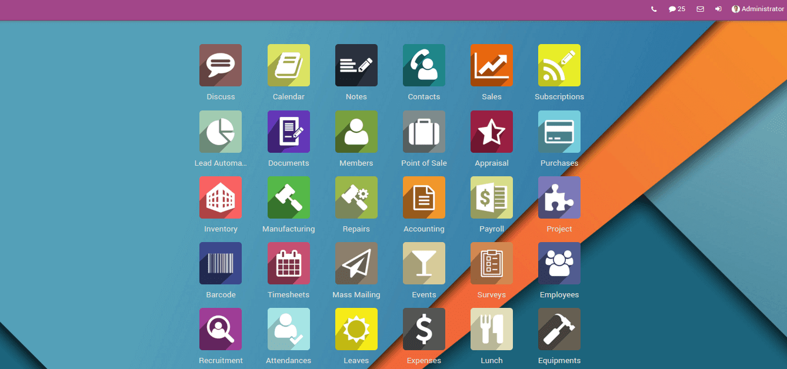

Recently, as I was working on Odoo, I came across a problem when I wanted to print a report. It was generating the HTML report just fine but when I wanted to download that report, it was having difficulty converting that report into PDF. Basically, the version of `wkhtmltopdf` library wasn’t compatible with the current setup.

I tried various solutions that I could find on the internet but none worked for me except the one I’m about to document here. Most of the solutions suggested that installing the `wkhtmltopdf version 0.12.1`, which is the recommended version from Odoo, would solve the issue but I wasn’t able to install it either as I was using Ubuntu 16.04 and some of the dependencies that were required to install the library weren’t supported.

Here’s what worked for me:

* First of all, remove the previous version of `wkhtmltopdf` that’s already installed on your system.
```bash
sudo apt-get remove wkhtmltopdf
sudo apt-get autoremove 
```

* Then go to the official site of [wkhtmltopdf](https://wkhtmltopdf.org/downloads.html) and download the latest version from there.
```bash
wget https://github.com/wkhtmltopdf/wkhtmltopdf/releases/download/0.12.4/wkhtmltox-0.12.4_linux-generic-amd64.tar.xz
```

* After that, unzip the file using this command.
```bash
tar -xf {file_name}
```
* Now, copy the files from the extracted folder into the `/usr/bin/` as this is the directory where Odoo looks for `wkhtmltopdf`.
```bash
sudo cp wkhtmltox/bin/wkhtmltoimage /usr/bin/
sudo cp wkhtmltox/bin/wkhtmltopdf /usr/bin/
```
* Restart your **Odoo Server** now. Everything should be working fine.

By following these steps, I was able to solve the problem at hand and hopefully, these will work for you too. Do let me know if it works.