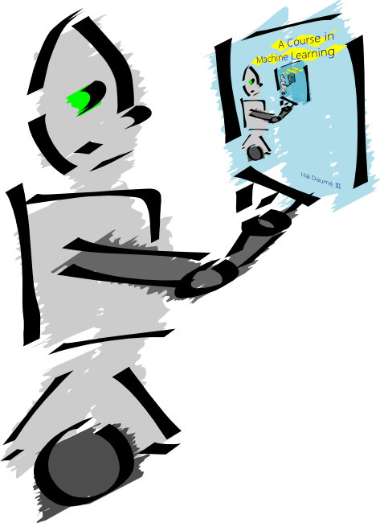
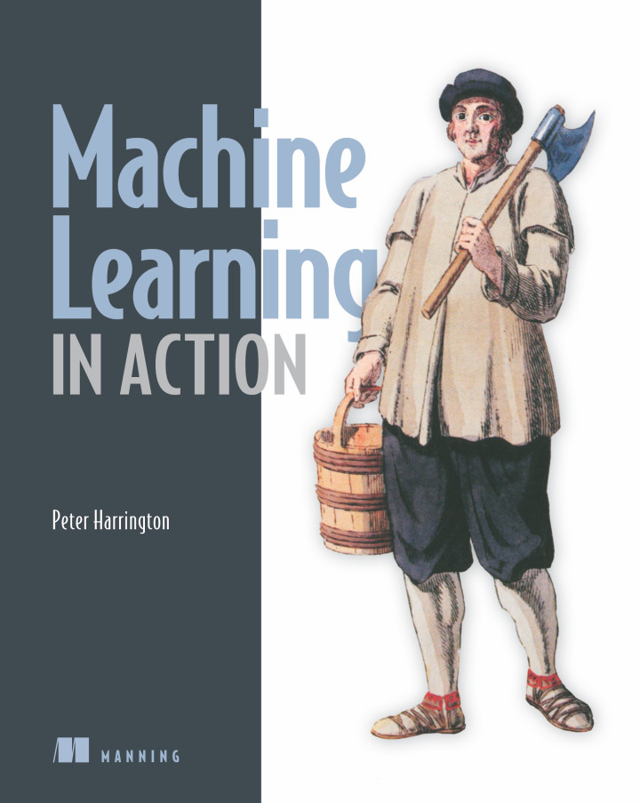

If you are interested in learning about Machine Learning, as everyone should be, I've compiled a list of resources that I've found to be quite valuable throughout my journey to become a Machine Learning Engineer. 

**Note:** This isn't supposed to be a complete list of resources for Machine Learning. You can find those on the web easily. This will only list the resources that I used and found valuable.

## Books
Throughout my life, I've found books to be the most valuable resource that one could have in order to better understand a topic. Online courses are a good resource to give a general introduction to wet your appetite but in order to satisfy your craving to learn more and in detail, books are the best things you could ask for.

### [A Course in Machine Learning](http://ciml.info/)

This books gives a general introduction to the different algorithms being used in the Machine Learning. Instead of relying heavily on math to explain the concepts, it uses ideas and models from the real-world. You can download this book for **free** although there is a catch, this book is a **work in progress** so some parts of the book and the algorithms might not have been written as of yet. But still, I highly recommend this book.

### [Machine Learning in Action](https://www.amazon.com/Machine-Learning-Action-Peter-Harrington/dp/1617290181)

This book follows a more hands-on approach with Python programs accompanying different Machine Learning algorithms to further solidify the concepts. I find this way of teaching more effective as one could easily test out different algorithms and experiment with them to see what works and how. I haven't completed this book as of yet but I'm planning to do so in the near future.

## Courses
Though books provide an in-depth knowledge about a certain topic, they aren't as effective as Video lectures when starting out. Video lectures are good for starting out in a new field or subject as they give a broad overview of the field and they are a more interactive medium for teaching about new concepts.

### [Udacity](https://www.udacity.com/)
The [Machine Learning Nanodegree](https://www.udacity.com/course/machine-learning-engineer-nanodegree--nd009t) offered by Udacity is one of the best resource for learning Machine Learning. The video lectures are well-structured and easy to understand. And the most important thing is the Projects that one have to complete in order to graduate from the Nanodegree. These projects help a lot in understanding the concepts that one is learning about by implementing them in some real-world scenario and seeing how it works.

You can also use [Free Courses](https://www.udacity.com/courses/machine-learning) instead of buying the whole Nanodegree program which might be a little expensive for some. The only drawback is that you won't have access to the Projects but you can watch the [Courses](https://www.udacity.com/courses/machine-learning) begin taught in the Nanodegree, free of cost.

### [Coursera Machine Learning](https://www.coursera.org/learn/machine-learning)
This course, taught by Andrew Ng, is one of the few courses that manages to explain some of the most technical and math-heavy concepts in Machine Learning in an intuitive and easy-to-understand manner. Instead of shying away from using scary mathematical equations, it explains them in such a way that one starts wondering how come he didn't get that before.

---

I will update this as I learn more resources, so keep an eye out for more goodies.